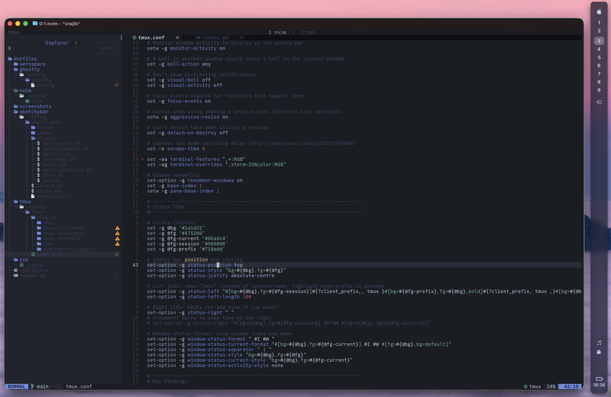

# dotfiles

my personal config files for macOS

## screenshot



## what's included

- **ghostty** - terminal emulator
- **nvim** - neovim config
- **tmux** - terminal multiplexer
- **zsh** - shell config
- **aerospace** - window manager
- **sketchybar** - macOS menu bar

## installation

i use [GNU stow](https://www.gnu.org/software/stow/) to manage symlinks.

```bash
# clone the repo
git clone https://github.com/snajib/dotfiles.git ~/dotfiles
cd ~/dotfiles

# install a specific config
stow nvim

# install everything
stow */
```

## uninstalling

```bash
# remove a specific config
stow -D nvim

# remove everything
stow -D */
```
